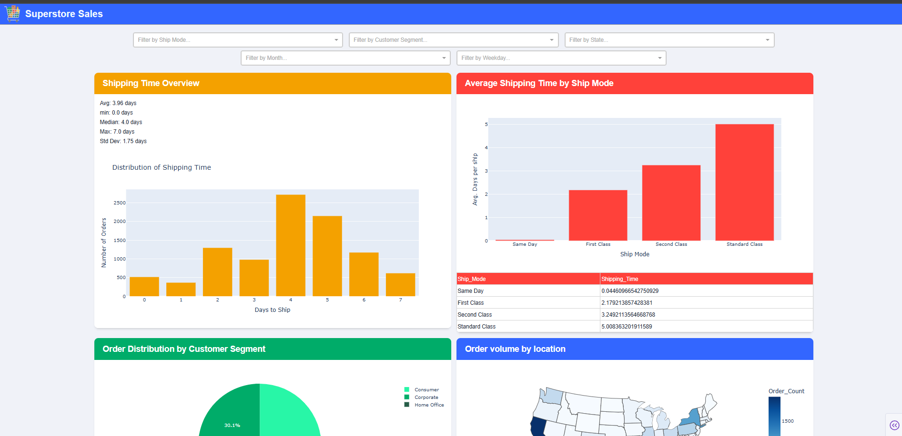

# 📊 Superstore Sales Dashboard

This project is an interactive web application built with **Dash (Plotly + Flask)** to visualize and explore sales data from a fictional superstore. It provides dynamic filters by ship mode, customer segment, state, month, and weekday.

---

## 📁 Project Structure
```
python_project_spring_2025/
├── dash_app.py # Main Dash app file
├── components.py # Layout components and charts
├── data.py # Data loading and processing class
├── data/
│ └── Superstore.csv # Original dataset
├── assets/
│ └── styles.css # Custom styles (if any)
│ └── icon.png
└── README.md # Project documentation
```
---

## 🚀 How to Run the App

### 1. Clone the repository
```
git clone https://github.com/Leonel-M/python_project_spring_2025.git 

cd python_project_spring_2025
```
### 2. Create a virtual environment (optional but recommended)
```
python -m venv .venv
.venv\Scripts\activate    # On Windows
Or on macOS/Linux:
source .venv/bin/activate
```
### 3. Install the required dependencies
```
pip install -r requirements.txt
```
### 4. Run the application
python dash_app.py
The app will be available at: http://127.0.0.1:8050

---

## 🧠 Features
Shipping time statistics

Interactive filters for multiple fields
Dynamic plots: histograms, bar charts, pie charts, and maps
Clean layout and modular design

---

## 📷 Screenshot


---

## 📦 Requirements
Python 3.8+
Dash
Plotly
Pandas

---

## ✍️ Author
Leonel Márquez
[LinkedIn](https://www.linkedin.com/in/leonel-marquez-sanchez/)
Email: leonel.amarquez92@gmail.com

---

## 📜 License
This project is licensed under the MIT License.
